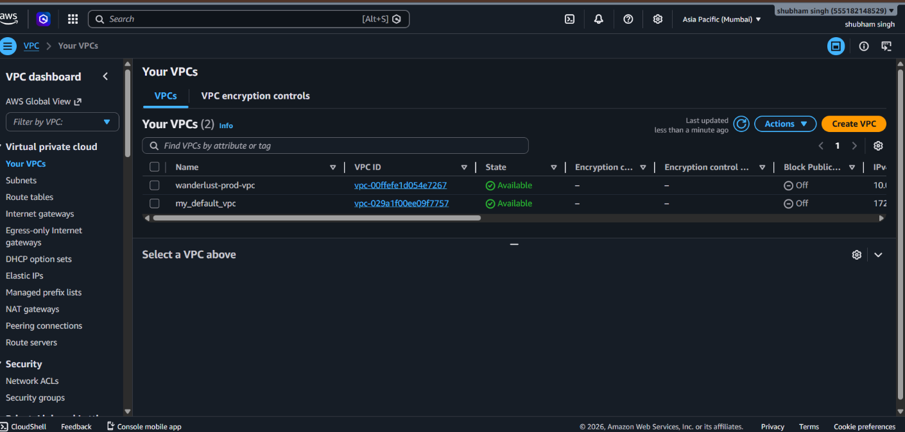
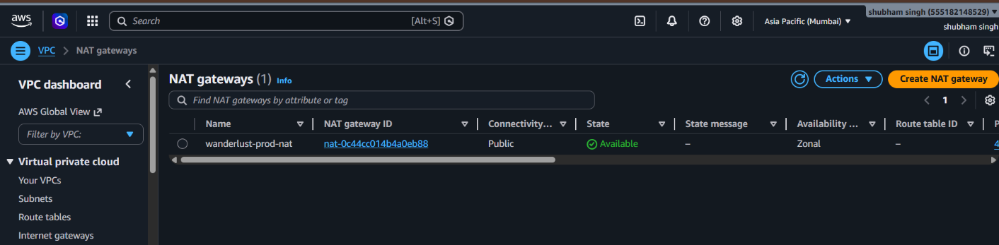
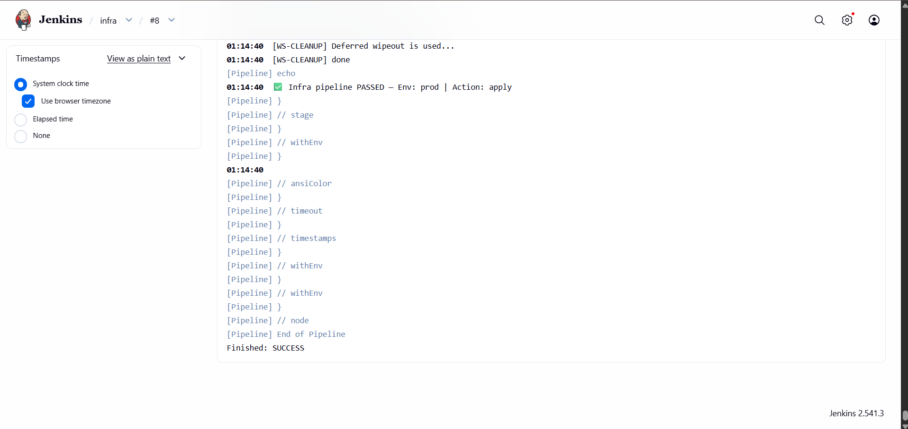
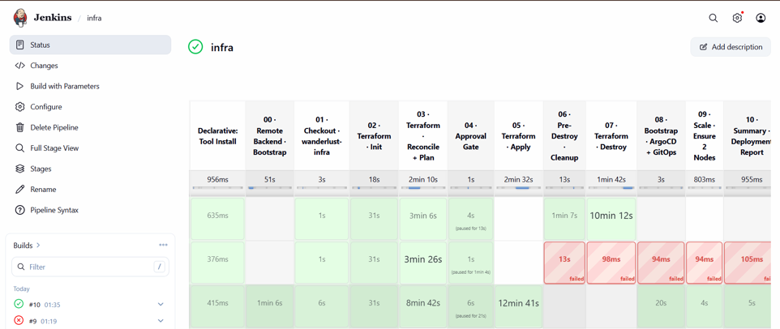
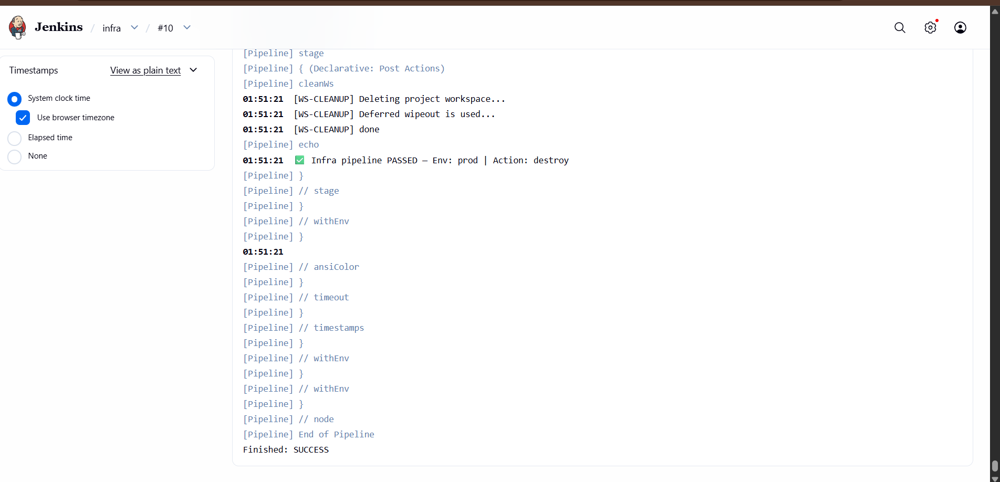

# wanderlust-infra

> Production-grade AWS infrastructure for the Wanderlust travel application — fully codified with Terraform, delivered through a Jenkins CI/CD pipeline, and bootstrapped with ArgoCD GitOps.

---

## Table of Contents

- [Overview](#overview)
- [Architecture](#architecture)
- [Repository Structure](#repository-structure)
- [Infrastructure Modules](#infrastructure-modules)
- [Pipeline Stages](#pipeline-stages)
- [Packer AMI](#packer-ami)
- [Prerequisites](#prerequisites)
- [Running the Pipeline](#running-the-pipeline)
- [Remote State](#remote-state)
- [Shared Library](#shared-library)
- [Environments](#environments)
- [Cost Estimate](#cost-estimate)
- [Troubleshooting](#troubleshooting)
- [Related Repositories](#related-repositories)
- [License](#license)

---

## Overview

This repository contains all infrastructure-as-code for the **Wanderlust** production environment on AWS. It is designed to be fully automated — a single Jenkins pipeline run provisions the entire stack from a blank AWS account to a live EKS cluster with ArgoCD ready to deploy the application.

* What gets created:**

| Layer | Resources |
|---|---|
| Networking | VPC, 2 public + 2 private subnets, IGW, NAT Gateway, route tables |
| Compute | EKS 1.34 cluster, managed node group (t3.medium × 2), Jenkins EC2 (t3.large) |
| Storage | S3 state bucket, DynamoDB lock table, 2× EBS gp3 volumes |
| IAM | OIDC provider, IRSA roles, EBS CSI addon, Jenkins instance profile |
| GitOps | ArgoCD installed via Helm, application synced from `wanderlust-gitops` |

Total resource count: **41 AWS resources**, created in ~30–40 minutes.

---

## Architecture

```
                    ┌──────────────────────────────────────────────────────┐
                    │                  AWS ap-south-1                      │
                    │                                                      │
                    │  ┌─────────────── wanderlust-prod-vpc ─────────────┐ │
                    │  │               10.0.0.0/16                       │ │
                    │  │                                                  │ │
                    │  │  ┌── Public Subnets ─────────────────────────┐  │ │
                    │  │  │  10.0.1.0/24  ·  10.0.2.0/24              │  │ │
                    │  │  │                                            │  │ │
                    │  │  │  ┌─────────────────────┐  ┌────────────┐  │  │ │
                    │  │  │  │  Jenkins  t3.large   │  │ NAT GW     │  │  │ │
                    │  │  │  │  + SonarQube :9000   │  │ EIP        │  │  │ │
                    │  │  │  │  + ArgoCD CLI        │  │ 65.0.0.136 │  │  │ │
                    │  │  │  │  + kubectl / helm    │  └────────────┘  │  │ │
                    │  │  │  │  + Terraform         │                  │  │ │
                    │  │  │  │  + AWS CLI / Trivy   │                  │  │ │
                    │  │  │  │  EIP: 65.0.0.136     │                  │  │ │
                    │  │  │  └─────────────────────┘                  │  │ │
                    │  │  └────────────────────────────────────────────┘  │ │
                    │  │                        │                         │ │
                    │  │                  NAT Gateway                     │ │
                    │  │                        │                         │ │
                    │  │  ┌── Private Subnets ────────────────────────┐  │ │
                    │  │  │  10.0.10.0/24  ·  10.0.11.0/24            │  │ │
                    │  │  │                                            │  │ │
                    │  │  │  ┌──────────────────────────────────────┐ │  │ │
                    │  │  │  │  EKS Cluster  wanderlust-prod-eks    │ │  │ │
                    │  │  │  │  Kubernetes 1.34                     │ │  │ │
                    │  │  │  │                                      │ │  │ │
                    │  │  │  │  node-1 t3.medium  node-2 t3.medium  │ │  │ │
                    │  │  │  │                                      │ │  │ │
                    │  │  │  │  ┌──────────┐   ┌─────────────────┐ │ │  │ │
                    │  │  │  │  │  ArgoCD  │   │ Prometheus      │ │ │  │ │
                    │  │  │  │  │ :argocd  │   │ + Grafana       │ │ │  │ │
                    │  │  │  │  └──────────┘   └─────────────────┘ │ │  │ │
                    │  │  │  │                                      │ │  │ │
                    │  │  │  │  ┌────────────────────────────────┐  │ │  │ │
                    │  │  │  │  │  wanderlust app  (GitOps sync) │  │ │  │ │
                    │  │  │  │  └────────────────────────────────┘  │ │  │ │
                    │  │  │  └──────────────────────────────────────┘ │  │ │
                    │  │  └────────────────────────────────────────────┘  │ │
                    │  └─────────────────────────────────────────────────┘ │
                    │                                                      │
                    │  S3 (tfstate)  ·  DynamoDB (lock)  ·  EBS  ·  ECR   │
                    └──────────────────────────────────────────────────────┘
                                            ▲
                                            │  terraform apply / destroy
                              ┌─────────────┴──────────────┐
                              │      Jenkins Pipeline        │
                              │                            │
                              │  00 · Remote Backend       │
                              │  01 · Checkout             │
                              │  02 · Terraform Init       │
                              │  03 · Reconcile + Plan     │
                              │  04 · Approval Gate  ←──── manual input
                              │  05 · Terraform Apply      │
                              │  06 · Pre-Destroy Cleanup  │
                              │  07 · Terraform Destroy    │
                              │  08 · Bootstrap ArgoCD     │
                              │  09 · Scale Nodes          │
                              │  10 · Deployment Summary   │
                              └────────────────────────────┘
```


---

## Repository Structure

```
wanderlust-infra/
├── Jenkinsfile                  # Infra pipeline entry point (@Library Shared)
├── bootstrap-gitops.sh          # ArgoCD + GitOps bootstrap script
│
├── packer/
│   ├── jenkins-ami.pkr.hcl      # Custom Jenkins AMI definition
│   └── scripts/                 # AMI provisioning scripts (tool installs)
│
├── remote-backend/
│   ├── backend.tf               # S3 + DynamoDB bootstrap backend config
│   ├── dynamodb.tf              # Lock table resource
│   ├── s3.tf                    # State bucket resource
│   ├── providers.tf
│   └── terraform.tf
│
└── terraform/
    ├── backend.tf               # S3 backend (prod workspace)
    ├── main.tf
    ├── variables.tf
    ├── providers.tf
    ├── backend-configs/
    │   ├── dev.hcl
    │   └── prod.hcl
    ├── env/
    │   ├── dev.tfvars
    │   └── prod.tfvars
    └── modules/
        ├── vpc/                 # VPC, subnets, NAT, IGW, route tables
        ├── eks/                 # EKS cluster, node group, OIDC, addons
        └── cicd-server/         # Jenkins EC2, EBS, EIP, IAM, SG
```

---

## Infrastructure Modules

### `modules/vpc`

Provisions the full network layer in `ap-south-1`.

- VPC `10.0.0.0/16` with DNS hostnames enabled
- **2 public subnets** (`ap-south-1a`, `ap-south-1b`) — for Jenkins EC2 and NAT Gateway
- **2 private subnets** (`ap-south-1a`, `ap-south-1b`) — for EKS worker nodes
- Internet Gateway for public subnet egress
- NAT Gateway (in public subnet) for private subnet outbound access
- Public and private route tables with correct subnet associations
- Kubernetes ELB discovery subnet tags



### `modules/eks`

Provisions the Kubernetes control plane and worker nodes.

- EKS 1.34 with `API_AND_CONFIG_MAP` authentication mode
- Control plane logs enabled: `api`, `audit`, `authenticator`
- Managed node group in private subnets — `t3.medium`, min 2 / max 3 nodes
- OIDC provider for IRSA (IAM Roles for Service Accounts)
- EBS CSI driver addon (`v1.32.0-eksbuild.1`) with dedicated IRSA role
- Jenkins IAM role granted cluster-admin via EKS access entry API



### `modules/cicd-server`

Provisions the Jenkins EC2 with everything pre-baked.

- EC2 launched from custom Packer AMI (`wanderlust-jenkins-*`)
- **Pre-installed tools:** Jenkins, Docker, kubectl, Helm, ArgoCD CLI, eksctl, Terraform, AWS CLI v2, Trivy, SonarQube
- 30 GB encrypted root volume (`gp3`)
- 30 GB encrypted EBS data volume for Jenkins home (`/dev/xvdf`)
- Elastic IP for a stable public address across stop/start cycles
- IAM instance profile: EKS full, ECR full, S3 backup, EC2 orchestration
- Security group: port 22 (SSH), 8080 (Jenkins), 9000 (SonarQube)

---

## Pipeline Stages

The pipeline is parameterised — `ACTION`, `ENVIRONMENT`, `AWS_REGION`, `SKIP_BOOTSTRAP`, and `BOOTSTRAP_REMOTE_INFRA` are all passed at runtime with no hardcoded values.

| Stage | Name | Action | Typical Duration |
|---|---|---|---|
| **00** | Remote Backend | Creates S3 + DynamoDB for Terraform state (first-time, flag-gated) | ~30s |
| **01** | Checkout | Clones `wanderlust-infra` into workspace | ~5s |
| **02** | Terraform Init | Initialises S3 backend, selects/creates workspace | ~18s |
| **03** | Reconcile + Plan | Imports pre-existing IAM/EC2 resources, runs `terraform plan` | ~2 min |
| **04** | Approval Gate | Manual review — displays plan summary, waits up to 15 min | varies |
| **05** | Terraform Apply | Applies the plan (`apply` action only) | ~25 min |
| **06** | Pre-Destroy Cleanup | Deletes LoadBalancer services + SG rules before VPC teardown (`destroy` only) | ~2 min |
| **07** | Terraform Destroy | Destroys all 41 resources in dependency order (`destroy` only) | ~10 min |
| **08** | Bootstrap ArgoCD | Runs `bootstrap-gitops.sh` — Helm install + ArgoCD app setup | ~5 min |
| **09** | Scale Nodes | Ensures node group has minimum 2 nodes ready | ~1 min |
| **10** | Deployment Summary | Prints ArgoCD URL, Jenkins IP, cluster info | ~1 min |

---

## Packer AMI

The custom AMI must be built **once** before the first `apply`. It pre-installs every tool the Jenkins server needs — no post-boot provisioning required.

```bash
cd packer/
packer init .
packer build .
```

Terraform automatically selects the most recent built AMI:

```hcl
data "aws_ami" "packer" {
  most_recent = true
  owners      = ["self"]
  filter {
    name   = "name"
    values = ["wanderlust-jenkins-*"]
  }
}
```

> **Note:** If no Packer AMI is found, the pipeline falls back to the latest Ubuntu 22.04 AMI. The fallback AMI will be missing required tools — always build the AMI first for production use.

---

## Prerequisites

Before triggering the pipeline for the first time, ensure the following are configured:

| Requirement | Where to Configure |
|---|---|
| Jenkins credential `aws-creds` | Manage Jenkins → Credentials *(username = access key ID, password = secret key)* |
| Jenkins credential `github` | Manage Jenkins → Credentials |
| EC2 key pair `portfolio-key-pair` | AWS Console → EC2 → Key Pairs → `ap-south-1` |
| Terraform tool `terraform-latest` | Manage Jenkins → Global Tool Configuration |
| Shared library `Shared` at `main` | Manage Jenkins → Configure System → Global Pipeline Libraries |
| S3 + DynamoDB state backend | Run Stage 00 once with `BOOTSTRAP_REMOTE_INFRA=true`, or apply `remote-backend/` manually |
| Packer AMI built | Run `packer build .` from `packer/` before the first apply |

---

## Running the Pipeline

### Apply — provision all 41 resources

```
ACTION                  → apply
ENVIRONMENT             → prod
AWS_REGION              → ap-south-1
SKIP_BOOTSTRAP          → false  (uncheck)
BOOTSTRAP_REMOTE_INFRA  → false  (uncheck)
```

**Total time:** ~30–40 minutes. EKS cluster ~8 min, node group ~10 min, ArgoCD Helm ~5 min.



---

### Destroy — tear down all resources

```
ACTION       → destroy
ENVIRONMENT  → prod
```

Stage 06 runs first — deletes LoadBalancer services via `kubectl` and clears Security Group rules, which is required for the VPC to be destroyed cleanly. Then Stage 07 destroys all 41 resources. **Total time:** ~12–15 minutes.

> ⚠️ **Always use `ACTION=destroy` through Jenkins.** Running `terraform destroy` manually skips Stage 06 cleanup, which causes VPC subnet dependency errors.



---

### Plan only — dry run with no changes

```
ACTION  → plan-only
```

Runs Init and Reconcile+Plan only. No approval gate, no infrastructure changes applied. Use this to preview the plan before committing to an apply.

---

## Remote State

Terraform state is stored in S3 and locked via DynamoDB, isolated per environment using workspaces.

| Resource | Value |
|---|---|
| S3 bucket | `my-s3-bucket-shubhamsinghprod` |
| DynamoDB table | `wanderlust-shubham-prod` |
| S3 key | `wanderlust/prod/terraform.tfstate` |
| Region | `ap-south-1` |

> * Note on the `dynamodb_table` deprecation warning:** This is a cosmetic warning from the AWS provider v5.x about the new `use_lockfile` parameter. State locking continues to work correctly and the warning is safe to ignore.

--

## Shared Library

All pipeline stage logic lives in the `shared-lib` repository and is loaded via `@Library('Shared') _`. This keeps the `Jenkinsfile` in this repo thin and the reusable logic centralised.

| File | Stage | Purpose |
|---|---|---|
| `infraPipeline.groovy` | All | Orchestrator — declares and sequences all 11 stages |
| `infraTerraform.groovy` | 02–05, 07 | `init()`, `reconcileAndPlan()`, `apply()`, `destroy()` |
| `infraBootstrap.groovy` | 08 | Runs `bootstrap-gitops.sh` after EKS reaches ACTIVE state |
| `infraCleanup.groovy` | 06 | LB + SG cleanup before destroy |
| `infraScale.groovy` | 09 | Scales node group to minimum 2 if below threshold |
| `infraSummary.groovy` | 10 | Prints ArgoCD URL and Jenkins IP |
| `infraRemoteBackend.groovy` | 00 | First-time S3 + DynamoDB bootstrap |

---

## Environments

| Environment | tfvars | Backend Config | Jenkins Instance | EKS Nodes |
|---|---|---|---|---|
| `prod` | `env/prod.tfvars` | `backend-configs/prod.hcl` | `t3.large` | `t3.medium` × 2 |
| `dev` | `env/dev.tfvars` | `backend-configs/dev.hcl` | `t3.medium` | `t3.medium` × 2 |

---

## Cost Estimate

Running costs in `ap-south-1` with the full prod stack live:

| Resource | ~Daily Cost |
|---|---|
| EKS control plane | $2.40 |
| 2× t3.medium worker nodes | $2.00 |
| Jenkins t3.large EC2 | $1.92 |
| NAT Gateway | $1.50+ |
| 2× EBS gp3 30 GB | $0.20 |
| **Total** | **~$8 / day** |

> **Tip:** Destroy when not in use. The pipeline gets you back to a fully running cluster in ~35 minutes.

---

## Troubleshooting

**S3 403 on `terraform init`**

The state bucket doesn't exist yet. Run Stage 00 with `BOOTSTRAP_REMOTE_INFRA=true`, or apply `remote-backend/` manually with a local backend first.

---

**EKS node group stuck in `CREATING` indefinitely**

Usually an EC2 instance type capacity restriction on newer AWS accounts. Check for events with:

```bash
aws autoscaling describe-scaling-activities \
  --region ap-south-1 \
  --max-items 3
```

---

**`data.aws_ami.packer` returns no results**

The Packer AMI hasn't been built yet. Run `packer build .` from the `packer/` directory before the first apply run.

---

**Groovy compile error — unexpected char `` ` ``**

Backtick escaping issue in JMESPath queries inside Groovy heredocs. Fix: double-escape in the Groovy string as `\\\\\\\``.

---

**VPC destroy fails with dependency errors**

Always trigger destroy via Jenkins (`ACTION=destroy`), not `terraform destroy` directly. Stage 06 deletes LoadBalancers and SG rules first — this is a hard requirement for the VPC subnets to be removed cleanly.

---

*DynamoDB state lock checksum error**

Caused by a stale lock entry. Resolve with:

```bash
aws dynamodb put-item \
  --table-name wanderlust-shubham-prod \
  --item '{"LockID": {"S": "wanderlust/prod/terraform.tfstate-md5"}, "Digest": {"S": "<correct-md5>"}}' \
  --region ap-south-1
```

---

# Related Repositories

| Repository | Purpose |
|---|---|
| [`wanderlust-infra`](https://github.com/shubhamsingh74888/wanderlust-infra) | **This repo** — infrastructure as code |
| [`shared-lib`](https://github.com/shubhamsingh74888/shared-lib) | Jenkins shared library — all pipeline stage logic |

---

# License

MIT — see [LICENSE](./LICENSE) for details.
